# AI MERN Print App

A full-stack print commerce platform built on the MERN stack. Handles AI-assisted artwork generation, product listing management, mockup rendering via Cloudinary, and Stripe-based checkout with webhook processing.

## Architecture



- **Client**: React 19 + Vite SPA with route guards and TanStack Query for server state.
- **API Layer**: Express 5 + TypeScript. Middleware-driven concerns: auth, async error capture, request validation.
- **Domain Layer**: Service-oriented business logic for listing lifecycle, mockup generation, and checkout flow.
- **Persistence**: MongoDB + Mongoose. Models for products, listings, orders, and related metadata.
- **Integrations**: Better Auth (session management), Cloudinary (media pipeline), Stripe (payments), remove.bg (background removal), and an AI image generation provider.

## Repository Layout

```
backend/
  src/
    config/         # Runtime config (env, db, cloudinary, stripe, http)
    controllers/    # Transport layer — req/res mapping
    middlewares/    # Auth, async handling, global error handling
    models/         # Mongoose schema definitions
    routes/         # Endpoint registration and route composition
    services/       # Domain and integration logic
    validators/     # Zod request contracts
    webhooks/       # Inbound event handlers (Stripe)

client/
  src/
    components/     # Composable UI + providers
    context/        # Canvas/editor state
    lib/            # API client and runtime env config
    pages/          # Route-level feature components
    routes/         # Router setup and auth guard strategy
```

## Tech Stack

**Backend**
- Node.js 20+, Express 5, TypeScript
- MongoDB + Mongoose
- Better Auth
- Cloudinary SDK
- Stripe SDK
- Zod

**Frontend**
- React 19, Vite, TypeScript
- React Router
- TanStack Query
- Axios
- Tailwind CSS

## Local Setup

**Prerequisites**
- Node.js 20+, npm 10+
- MongoDB (local or Atlas)
- Cloudinary, Stripe, and remove.bg accounts

**Install**

```bash
cd backend && npm install
cd ../client && npm install
```

**Run**

```bash
# Terminal 1
cd backend && npm run dev

# Terminal 2
cd client && npm run dev
```

Default endpoints:

| Service | URL |
|---|---|
| Frontend | http://localhost:5173 |
| Backend | http://localhost:8000 |
| Health check | http://localhost:8000/health |

## Environment Configuration

**`backend/.env`**

```env
NODE_ENV=development
PORT=8000
BASE_URL=http://localhost:8000
MONGO_URI=mongodb+srv://<user>:<pass>@<cluster>/<db>

BETTER_AUTH_SECRET=<secret>
BETTER_AUTH_URL=http://localhost:8000

GOOGLE_CLIENT_ID=<google-client-id>
GOOGLE_CLIENT_SECRET=<google-client-secret>

CLOUDINARY_CLOUD_NAME=<cloud-name>
CLOUDINARY_API_KEY=<api-key>
CLOUDINARY_API_SECRET=<api-secret>

REMOVE_BG_API_KEY=<remove-bg-api-key>

STRIPE_SECRET_KEY=<stripe-secret-key>
STRIPE_WEBHOOK_SECRET=<stripe-webhook-secret>

FRONTEND_ORIGIN=http://localhost:5173
```

**`client/.env`**

```env
VITE_FRONTEND_URL=http://localhost:5173
VITE_BASE_API_URL=http://localhost:8000
VITE_API_URL=http://localhost:8000/api
```

## API Reference

Base prefix: `/api`

| Method | Route | Auth | Description |
|---|---|---|---|
| ALL | `/api/auth/*` | — | Better Auth handlers |
| GET | `/api/product/all` | Required | List all products |
| GET | `/api/product/:id` | Required | Get product by ID |
| GET | `/api/listing/all` | Required | List all listings |
| GET | `/api/listing/:slug` | Public | Get listing by slug |
| GET | `/api/listing/mockup/:slug/:colorName` | Public | Get listing mockup by color |
| POST | `/api/listing/generate-artwork` | Required | Generate AI artwork |
| POST | `/api/listing/create` | Required | Create listing |
| POST | `/api/order/create` | Public | Create Stripe checkout session |
| GET | `/api/order/user` | Required | Get orders for current user |
| POST | `/api/webhook/stripe` | Raw body + signature | Stripe webhook handler |

## Build

```bash
# Backend
cd backend && npm run build && npm run start

# Client
cd client && npm run build && npm run preview
```

## Troubleshooting

**401 on protected endpoints**
- Confirm a valid session exists and cookies are present in the request.
- Verify `FRONTEND_ORIGIN`, `VITE_BASE_API_URL`, and `VITE_API_URL` are consistent across both environments.
- Ensure all requests include `credentials: 'include'` (or `withCredentials: true` in Axios).

**Mockup not found**
- Confirm the listing exists and the requested `colorName` slug is mapped to the listing.
- Verify the correct `slug` is being passed.

**Stripe webhook failures**
- Ensure webhook events are forwarded to `/api/webhook/stripe`.
- Confirm `STRIPE_WEBHOOK_SECRET` matches the active endpoint secret in the Stripe dashboard.
- The route requires a raw (unparsed) request body — verify no body-parser middleware is applied upstream.